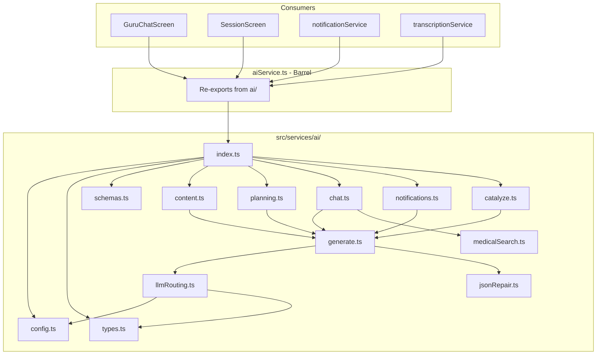

# Refactor Monolithic AI Service

## Current State

[src/services/aiService.ts](src/services/aiService.ts) is **1180 lines** and handles:

| Domain | Functions / Types | ~Lines |
|--------|-------------------|--------|
| Config & API keys | getApiKeys, OPENROUTER_FREE_MODELS, GROQ_MODELS | 1-30 |
| Types & schemas | Message, Zod schemas (KeyPoints, Quiz, Story, etc.), AgendaResponse, MedicalGroundingSource | 32-94 |
| Local LLM (llama.rn) | getLlamaContext, releaseLlamaContext, callLocalLLM, attemptLocalLLM | 112-330 |
| Cloud LLM (Groq, OpenRouter) | callGroq, callGroqText, callOpenRouter, attemptCloudLLM | 206-403 |
| JSON repair | stripJsonCodeFences, extractBalancedJson, repairCommonJsonIssues, repairTruncatedJson | 404-556 |
| Core routing | parseStructuredJson, generateJSONWithRouting, generateTextWithRouting | 558-681 |
| Content generation | fetchContent, prefetchTopicContent | 684-711 |
| Session planning | planSessionWithAI, generateAccountabilityMessages, generateGuruPresenceMessages | 712-791 |
| Chat | chatWithGuru, chatWithGuruGrounded, askGuru | 794-1134 |
| Notifications | generateWakeUpMessage, generateBreakEndMessages | 820-864 |
| Medical search | searchWikipedia, searchEuropePMC, searchPubMedFallback, searchLatestMedicalSources | 873-1034 |
| Transcript analysis | catalyzeTranscript | 1144-1181 |

**14 consumers** import from `aiService`: GuruChatScreen, LectureReturnSheet, SessionScreen, BreakScreen, BossBattleScreen, ReviewScreen, DailyChallengeScreen, InertiaScreen, ContentCard, SleepModeScreen, notificationService, sessionPlanner, backgroundTasks, useGuruPresence, transcriptionService, lectureSessionMonitor, GuruChatOverlay, offlineQueueBootstrap.

---

## Target Architecture

---

## Module Breakdown

| Module | Responsibility | Exports | Dependencies |
|--------|----------------|---------|--------------|
| **config.ts** | API keys, model lists | getApiKeys, OPENROUTER_FREE_MODELS, GROQ_MODELS, BUNDLED_GROQ_KEY | getUserProfile |
| **types.ts** | Shared interfaces | Message, GuruEventType, GuruPresenceMessage, AgendaResponse, MedicalGroundingSource, GroundedGuruResponse | — |
| **schemas.ts** | Zod schemas | All content/agenda schemas, RateLimitError | — |
| **jsonRepair.ts** | JSON parsing/repair | parseStructuredJson, stripJsonCodeFences, extractBalancedJson, repairCommonJsonIssues, repairTruncatedJson | — |
| **llmRouting.ts** | LLM backend calls | callLocalLLM, attemptLocalLLM, attemptCloudLLM, releaseLlamaContext | config, types, deviceMemory, offlineQueueErrors, llama.rn |
| **generate.ts** | Core routing | generateJSONWithRouting, generateTextWithRouting | llmRouting, jsonRepair, schemas, config |
| **medicalSearch.ts** | Web search (Wikipedia, EuropePMC, PubMed) | searchLatestMedicalSources, buildMedicalSearchQuery, clipText, dedupeGroundingSources | — |
| **content.ts** | Content cards | fetchContent, prefetchTopicContent | generate, schemas, prompts, aiCache |
| **planning.ts** | Session/accountability | planSessionWithAI, generateAccountabilityMessages, generateGuruPresenceMessages | generate, schemas, prompts |
| **chat.ts** | Guru chat | chatWithGuru, chatWithGuruGrounded, askGuru | generate, medicalSearch |
| **notifications.ts** | Wake-up / break messages | generateWakeUpMessage, generateBreakEndMessages | generate |
| **catalyze.ts** | Transcript analysis | catalyzeTranscript | generate, schemas |
| **index.ts** | Barrel | Re-exports all public API | All modules |

---

## Implementation Phases

### Phase 1: Extract Foundation (No Behavior Change)

1. Create `src/services/ai/` directory.
2. Extract **config.ts** — getApiKeys, model constants.
3. Extract **types.ts** — Message, GuruEventType, GuruPresenceMessage, AgendaResponse, MedicalGroundingSource.
4. Extract **schemas.ts** — all Zod schemas, RateLimitError.
5. Extract **jsonRepair.ts** — stripJsonCodeFences, extractBalancedJson, repairCommonJsonIssues, repairTruncatedJson, parseStructuredJson.
6. Update **aiService.ts** to import from these modules and re-export. Run typecheck + lint + tests. All must pass.

### Phase 2: Extract LLM Layer

1. Extract **llmRouting.ts** — getLlamaContext, releaseLlamaContext, callLocalLLM, callGroq, callGroqText, callOpenRouter, attemptLocalLLM, attemptCloudLLM, AppState listener.
2. Extract **generate.ts** — generateJSONWithRouting, generateTextWithRouting.
3. Update aiService.ts to import from llmRouting and generate. Verify.

### Phase 3: Extract Feature Modules

1. Extract **medicalSearch.ts** — searchWikipedia, searchEuropePMC, searchPubMedFallback, searchLatestMedicalSources, buildMedicalSearchQuery, clipText, dedupeGroundingSources, renderSourcesForPrompt, fetchJsonWithTimeout.
2. Extract **content.ts** — fetchContent, prefetchTopicContent.
3. Extract **planning.ts** — planSessionWithAI, generateAccountabilityMessages, generateGuruPresenceMessages (with FALLBACK_MESSAGES).
4. Extract **chat.ts** — chatWithGuru, chatWithGuruGrounded, askGuru.
5. Extract **notifications.ts** — generateWakeUpMessage, generateBreakEndMessages (with FALLBACK_BREAK_MESSAGES).
6. Extract **catalyze.ts** — catalyzeTranscript.
7. Create **ai/index.ts** — re-exports everything.
8. Replace aiService.ts body with: `export * from './ai';` (or equivalent re-exports).

### Phase 4: Verification and Cleanup

1. Run `npm run typecheck` — must pass.
2. Run `npm run lint` — must pass.
3. Run `npm run test:unit` — must pass.
4. Update CLAUDE.md AI Service section to reference the new structure.
5. Optionally: update consumers to import from `./ai` directly (e.g. `from '../services/ai'`) for clearer dependency graph. This is optional; the barrel keeps all existing imports working.

---

## Backward Compatibility

- **aiService.ts** remains the public entry point. It will be a thin file that re-exports from `ai/index.ts`.
- All 14 consumers continue to use `from '../services/aiService'` or `from './aiService'` — no consumer changes required in Phase 1–4.
- Optional Phase 5: migrate consumers to `from '../services/ai'` for more explicit imports (e.g. `from '../services/ai/content'` for fetchContent only).

---

## Risk Mitigation

- **Incremental extraction**: One module at a time, with typecheck/lint/test after each.
- **No logic changes**: Pure extraction; no refactoring of algorithms.
- **Barrel pattern**: aiService.ts stays as the single import target until we choose to migrate consumers.
- **Circular dependency avoidance**: Dependency order is strict: config/types/schemas → jsonRepair → llmRouting → generate → feature modules.

---

## Files Changed

| Action | Path |
|--------|------|
| Create | src/services/ai/config.ts |
| Create | src/services/ai/types.ts |
| Create | src/services/ai/schemas.ts |
| Create | src/services/ai/jsonRepair.ts |
| Create | src/services/ai/llmRouting.ts |
| Create | src/services/ai/generate.ts |
| Create | src/services/ai/medicalSearch.ts |
| Create | src/services/ai/content.ts |
| Create | src/services/ai/planning.ts |
| Create | src/services/ai/chat.ts |
| Create | src/services/ai/notifications.ts |
| Create | src/services/ai/catalyze.ts |
| Create | src/services/ai/index.ts |
| Replace | src/services/aiService.ts (become thin barrel) |
| Update | CLAUDE.md |
