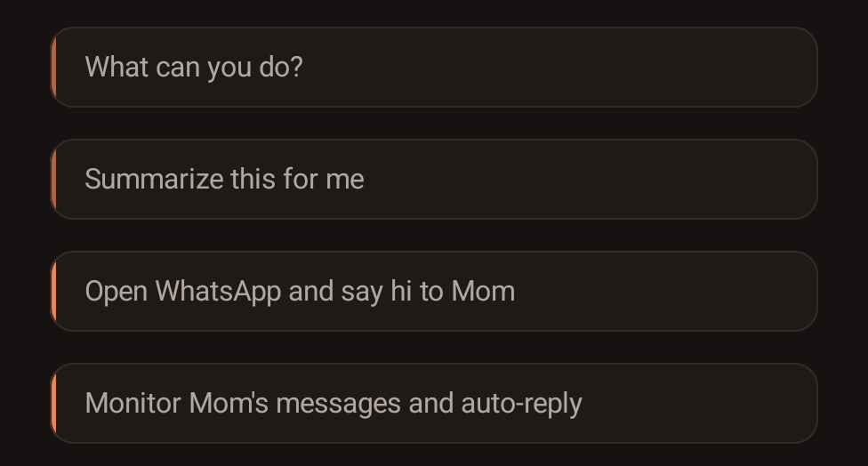

<p align="center">
  
</p>
<p align="center">
  
</p>

<p align="center">
  <a href="https://github.com/agents-io/PokeClaw/stargazers"></a>
  <a href="https://github.com/agents-io/PokeClaw/network/members"></a>
  <a href="https://github.com/agents-io/PokeClaw/issues?q=is%3Aissue+is%3Aclosed"></a>
  
  <a href="https://github.com/agents-io/PokeClaw/releases/latest"></a>
</p>

<p align="center">
  🌐 <a href="https://agents-io.github.io/PokeClaw/">Landing Page</a> — available in English · हिन्दी · 日本語 · Deutsch · 繁中
</p>

# PokeClaw (PocketClaw) — On-Device AI Phone Agent

**PokeClaw**, also known as **PocketClaw**, is an open-source Android app for AI phone automation.

It can run Gemma 4 on-device for local, private phone control, and it also supports optional cloud models when you want stronger reasoning for harder tasks.

The current public build is a local-first prototype for turning an Android phone into an AI-operated device.

In Local mode, model execution stays inside your device. No account or API key is required for Local mode.


```
Everyone else:  Phone → Internet → Cloud API → Internet → Phone
                       💳Credit card needed, API key required. Monthly bill attached.

PokeClaw local: Phone → LLM → Phone
                       Local-first when you want it. Optional cloud when you need it.
```
**AI can control your phone, with local-first execution and optional cloud help.**

The current public build is open-source and already handles real chat, task, and automation flows on Android.

Monitor a WhatsApp contact and auto-reply:


Context-aware WhatsApp auto-reply:

https://github.com/user-attachments/assets/5a43d4d5-458a-4eea-a0a5-58d113255741

https://github.com/user-attachments/assets/5c2966c5-04e6-4b22-8d66-11915ae62096

> **☝️ Auto-reply demo:** PokeClaw monitors messages from Mom, reads what she said, and replies based on context using the on-device LLM. [Watch in higher resolution on YouTube](https://youtube.com/shorts/Vxpf474chm0)

> **☝️ Context demo:** Mom asks "what did I tell you to bring?" — the AI opens the chat, reads the full conversation on screen, sees the earlier message about wine, and replies correctly. This is the difference between context-aware and context-free replies.

https://github.com/user-attachments/assets/89999dd8-a1be-49ad-9419-60c2b38f6374


> **Why is the "hi" demo slow?** That clip was recorded on a CPU-only Android device with no usable GPU or NPU path. Running Gemma 4 E2B on pure CPU takes about 45 seconds to warm up. On stronger phones it is much faster:
> - **Google Tensor G3/G4** (Pixel 8, Pixel 9)
> - **Snapdragon 8 Gen 2/3** (Galaxy S24, OnePlus 12)
> - **Dimensity 9200/9300** (recent MediaTek flagships)
> - **Snapdragon 7+ Gen 2+** (mid-range with GPU)
>
> On these devices, warmup drops to seconds. Same model, better hardware.


## The Story

I'm building this solo. When Gemma 4 landed with native tool calling on LiteRT-LM, I wanted to know whether a phone could become a real on-device agent instead of just another chatbot. PokeClaw is the result.

The interesting part is not just chatting with a local model. The interesting part is getting a local model to read the screen, choose tools, operate apps, keep task state, and finish real phone workflows. That is exactly what this project is built for.

PokeClaw already supports fully on-device automation with Gemma 4 and optional cloud models for stronger task execution. The current focus is broader device support, more generic skills, more local model options, and a cleaner public release path.

**If you hit something interesting, [open an issue](https://github.com/agents-io/PokeClaw/issues).** Real device reports are how this gets better fast.

## Product Direction

PokeClaw is not just a chat app with a few phone-control tricks glued on top.

At its core, it is becoming a **mobile agent harness**:

- a generic tool layer for phone control
- a task/runtime loop that lets a model choose and chain those tools
- playbooks, rules, and guards that can be iterated against real device QA
- a product shell on top so the same harness is usable by normal people, not just developers

That distinction matters. The long-term goal is not to hardcode one-off app flows forever. The goal is to build the strongest practical harness for AI phone agents on Android, then ship product experiences on top of that foundation.

That is also why the project invests so heavily in:

- generic tools before narrow workflows
- repeated real-device QA instead of one-off demos
- Cloud vs Local model comparisons on the same task families
- playbooks and rules only when the model proves it needs extra structure

## See the UI

👉 **[Try the interactive demo on our landing page](https://agents-io.github.io/PokeClaw/)** — click through every screen without installing anything.

## What it does

The model picks the right tool, fills in the parameters, and executes. You don't configure anything per-app. It just reads the screen and acts.

## Proven Quick Tasks

These are tasks we have already run end-to-end during on-device QA.

### Local mode

- Summarize notifications
- Explain clipboard contents
- Analyze storage / apps and suggest cleanup targets
- Check whether the battery needs charging
- Report installed apps
- Report phone temperature
- Report Bluetooth state
- Report battery, storage, and Android version
- Run quick-task cards directly from the UI and return the result in chat
- Route contact-specific send / call tasks correctly and fail cleanly when the contact does not exist on the device

### Cloud mode

- Send a WhatsApp message and auto-return to the same PokeClaw conversation
- Search inside YouTube in the real app
- Check what is trending on Twitter / X and summarize it
- Install or open Telegram from Play Store
- Open Reddit and search for `pokeclaw`
- Copy the latest email subject and Google it
- Draft an email saying you will be late
- Preserve task state and session history across cross-app execution and return

## Benchmark & Real-Device QA

Every number below comes from repeated trials on a physical Pixel 8 Pro running release builds. No cherry-picked runs, no emulators. The full verified task list and tier breakdown is in [thoughts/verified-task-capabilities.md](thoughts/verified-task-capabilities.md).

### Cloud (GPT-4.1) — 18/20 pass, real tasks on real phone

| Task | Result | Rounds | What happens |
|---|---:|---:|---|
| Search YouTube for lofi beats | ✅ | 9 | Opens YouTube, types query, hits search |
| Open Chrome and search for weather | ✅ | 9 | Opens Chrome, types query, reads results |
| Open Chrome and go to reddit.com | ✅ | 7 | URL navigation with node_id targeting |
| Compose email to test@example.com | ✅ | 12 | Opens Gmail, fills To + Subject + Body |
| Install Telegram from Play Store | ✅ | 14 | Search + tap Install + wait |
| Turn on do not disturb | ✅ | 12 | Navigates Settings, toggles DND |
| Open Settings, go to About Phone | ✅ | varies | Deep settings navigation |
| Send hi to Mom on WhatsApp | ✅ | 5 | Opens WhatsApp, finds contact, types, sends |
| Check my Instagram messages | ✅ | 5 | Handles typo ("instagarm"), opens correct app |
| 部機仲有幾多storage | ✅ | 2 | Cantonese input, returns answer in 中文 |
| 打開Instagram | ✅ | varies | Chinese command |
| Draft an email saying I'll be late | ✅ **10/10** | 8 | Repeated trials: 100% pass rate |
| Copy latest email subject and Google it | ✅ **8/10** | 15 | Gmail to Chrome cross-app flow, 80% pass rate |

All tasks use zero hardcoded app logic. The model reads the screen, picks tools, and figures out the flow on its own. Multi-language works out of the box, including Cantonese, Mandarin, and misspelled English.

### Local (Gemma 4 E2B, fully on-device) — verified on CPU and GPU

| Task family | Result | CPU avg (Pixel 8 Pro) | GPU avg (Pixel 8 Pro) | Notes |
|---|---:|---:|---:|---|
| Clipboard explain | ✅ | 2m 43s | 2m 11s | Real clipboard read |
| Notifications summary | ✅ | 2m 49s | 2m 53s | Reads live notifications and summarizes |
| Battery advice | ✅ | 2m 12s | 2m 53s | Returns level + charging state |
| Storage + apps cleanup advice | ✅ | 2m 33s | 3m 06s | Harness used to mislabel this as blocked because the answer mentioned the Contacts app |

For the current `local-core` quick-task bundle on a Pixel 8 Pro, Gemma 4 E2B passed `4/4` on both CPU and GPU. Cold-start average time was `2m 34s` on CPU versus `2m 46s` on GPU, so GPU is now **verified and usable** on this device, but it is **not yet a cold-start speed win** for this short task bundle. The value of the recent hardening work is stability and real backend verification, not inflated benchmark theater.


## How it works

PokeClaw gives a small on-device LLM a set of tools (tap, swipe, type, open app, send message, enable auto-reply, etc.) and lets it decide what to do. The LLM sees a text representation of the current screen, picks an action, sees the result, picks the next action, until the task is done.

Local execution runs via [LiteRT-LM](https://ai.google.dev/edge/litert/llm/overview) with native tool calling. In Local mode, the model runs on-device.

## Tools

The LLM has access to these tools and picks them autonomously:

| Tool | What it does |
|------|-------------|
| `tap` / `swipe` / `long_press` | Touch the screen |
| `input_text` | Type into any text field |
| `open_app` | Launch any installed app |
| `send_message` | Full messaging flow: open app, find contact, type, send |
| `auto_reply` | Monitor a contact and reply automatically using LLM |
| `get_screen_info` | Read current UI tree |
| `take_screenshot` | Capture screen |
| `finish` | Signal task completion |

These tools are generic — they work with any app, any contact, any language. The LLM picks the right tool and fills in the parameters from your request.

## Tools + Skills

Small on-device models get dramatically better when you give them a strong playbook. So we give PokeClaw reusable skills on top of generic tools.

The auto-reply feature is a good example. It doesn't work by magic — there's a predefined workflow behind it: open the chat → read all visible messages on screen → generate a context-aware reply → send it → go back to home. The model follows this recipe step by step. Every tool in that chain is generic: `open_app` works with any app, `read_screen` works on any screen, `send_message` works with any contact. The workflow just tells the model which tools to use and in what order.

This is what we're calling **Skills** — reusable workflows built from generic tools. We're actively designing a skill system inspired by [Claude Code's skill architecture](https://docs.anthropic.com/en/docs/claude-code/skills). The idea: anyone can write a skill as a simple text file that describes the steps, and the LLM follows it.

Some examples of what skills can do:

- **Auto-reply**: monitor notifications → open chat → read conversation → generate reply → send
- **Morning briefing**: open weather app → read temperature → open calendar → read today's events → open email → count unread → summarize everything
- **Smart forward**: catch a notification → open the message → read it → forward to another contact with a summary
- **Auto-booking**: open a booking app → search for a time slot → fill in details → confirm

Each skill is just a combination of the same generic tools (`open_app`, `tap`, `type`, `read_screen`, `send_message`, etc.) arranged in a specific order. The tools are the building blocks, the skills are the recipes.

Both are designed to be extensible. We're building the first 8-10 skills as built-in defaults. If the system works well, we'll open it up for the community to create and share their own tools and skills. You know your phone better than we do — you should be able to teach it new tricks.

As on-device models get smarter, more of this can become free-form. Right now, skills are how we get reliable automation out of a small local model while keeping the tool layer generic.

## Download

[**Download APK**](https://github.com/agents-io/PokeClaw/releases/latest)

> Note: If you are updating from an older public debug build and Android says the package is incompatible, uninstall the old build once and then install the latest APK fresh. Older public debug builds still receive the in-app update prompt, but they need a one-time reinstall before joining the stable-signed `0.6.x` line.

### Requirements

| | Minimum | Recommended |
|---|---|---|
| **Android** | 9+ | 12+ |
| **Architecture** | arm64 | arm64 |
| **RAM** | 8 GB | 12 GB+ |
| **Storage** | 3 GB free (model download) | 5 GB+ |
| **GPU** | Not required (CPU works) | Tensor G3/G4, Snapdragon 8 Gen 2+, Dimensity 9200+ |
| **Root** | Not required | Not required |

> ⚠️ 8 GB gets you in the door. 12 GB+ is the sweet spot for the built-in Gemma 4 local models, especially if you want smoother multitasking and faster model bring-up.

## Quick start

1. Install the APK
2. Grant Accessibility permission when prompted
3. If you want background monitor flows, also grant Notification Access
4. In Local mode, the model downloads on first local launch (~2.6 GB)
5. Switch to Chat or Task mode and start using it

Local mode needs no account and no API key. Cloud mode is optional.

## Roadmap

This is the current direction for PokeClaw based on real device testing, open issues, and the most common feature requests.

### Near-term

- **Stabler public releases and upgrades.** The release/signing path is being locked down so future public APKs upgrade cleanly instead of falling back to uninstall/reinstall behavior from the older debug-signed builds.
- **Missed-call auto follow-up.** A high-priority use case is: someone calls, you miss it, and PokeClaw automatically sends a follow-up message to that caller and keeps the status visible in the same chatroom. The preferred first path is SMS/API-first. WhatsApp follow-up is only worth adding if there is a reliable non-UI route; otherwise it should stay an explicit fallback path, not the core design.
- **Lower-RAM local model options.** Right now the built-in local model choices are still too heavy for a lot of mid-range phones. Smaller on-device models are high priority.
- **More small local models for real device coverage.** 1B–1.5B class models for lower-end phones are on the roadmap so more devices can at least run a usable local agent instead of being locked out by RAM limits.
- **More reliable local model downloads.** Resume/retry behavior, partial download cleanup, and corrupted-model detection are all being hardened so downloads survive weak connections and screen-off/resume cases better.
- **Broader device compatibility.** Samsung, Xiaomi, Dimensity, and low-RAM device issues are being used as real-world test cases for GPU→CPU fallback, model loading, accessibility reconnects, and generic UI control.
- **More generic phone-control skills.** We are continuing to replace brittle, app-specific assumptions with generic tools and reusable skills so tasks survive OEM UI changes better.

### In progress

- **Import your own local `.litertlm` models.** User-accessible local model import is on the roadmap so you can bring your own LiteRT model instead of being locked to the built-in download list.
- **Custom local model sources.** We want PokeClaw to go beyond a fixed built-in catalog and support user-defined model sources, including direct downloads from Hugging Face or other hosted URLs.
- **Google AI Core / system local AI integration.** We are tracking Android's newer on-device AI stack so PokeClaw can eventually use official system-level local model APIs where they make sense, instead of relying on a single runtime path forever.
- **More built-in workflows.** More quick-task / skill coverage is planned beyond the first WhatsApp-centric workflows.
- **Remote control / remote conversation flows.** Controlling a phone from another device is a real request and is on the longer roadmap, but it is not the current top priority compared with local reliability and device coverage.

### Known platform constraints

- **Edge Gallery model detection is not fully under our control.** Android hides other apps' `Android/data/...` sandboxes from normal file-pickers, so PokeClaw cannot generically "see" Edge Gallery's downloaded models unless they are exported into a user-accessible location first.
- **Sideload + accessibility apps may trigger OEM security warnings.** Samsung / Play Protect warnings are being addressed through a cleaner release/signing path, but sideload trust prompts are partly controlled by the platform and OEM policy.

### Where feature requests go

If you want something added, please open an issue. The roadmap above is intentionally built from real requests like:

- missed-call auto follow-up messages
- smaller local models for lower-end phones
- importing your own local models
- custom local model sources / hosted downloads
- Android AI Core / official on-device AI support
- cleaner upgrade/install paths
- remote control from another phone
- broader distribution paths like F-Droid

## Help Wanted

PokeClaw is moving fast, and the roadmap is being shaped directly by real device reports, feature requests, and QA results. If you want to help push local phone agents forward:

- ⭐ **[Star this repo](https://github.com/agents-io/PokeClaw)** if you think local AI phone control matters
- 🐛 **[Open an issue](https://github.com/agents-io/PokeClaw/issues)** when you hit a bug or want a feature
- 🍴 **[Fork it](https://github.com/agents-io/PokeClaw/fork)** and build on it

Every star helps more people find the project. Every issue helps shape the next release.

## Changelog

### v0.6.0 (2026-04-11)
- **Mainline release hardening.** Cloud and Local chat/task flows were tightened before release instead of shipping more speculative features on top.
- **Cloud task routing is less fragile.** Ordinary chat prompts like `say hi` no longer misroute into send-message behavior, while Cloud task flows still retain their multi-step capability.
- **Local chat continuity is materially better.** The on-device chat session now restores visible conversation history after session rebuilds and app relaunches, instead of silently losing the earlier turns.
- **Cloud and Local relaunch continuity are now verified.** Same-conversation memory survives a full force-stop/relaunch on both Cloud and Local paths.
- **Direct device-data tasks are more truthful.** Clipboard, notifications, battery, storage, and installed-app questions use the real device tools instead of generic chatbot refusals.
- **Models and settings are more honest.** The Models page now separates `Active model`, `Default local model`, and `Default cloud model`, and linked built-in Gemma rows no longer pretend the model is missing when the file is already usable.
- **Cloud model switching is cleaner.** Switching cloud models now emits one clear system line instead of duplicate switch messages.
- **Task/process UI is less noisy.** Normal chat no longer shows the orange `Task running...` bar, while true long-running work still shows the correct active state.
- **Local session ownership is hardened.** Chat-side local loading now stands down while a Local task owns the LiteRT session, preventing the old `session already exists` race.
- **Cloud release QA now uses success rate, not single-run theater.** The headline compose task passed `10/10`, and the Gmail-subject-to-Google exploratory task passed `8/10`, which is the right standard for stochastic Cloud flows.

### v0.5.1 (2026-04-10)
- **Chat/task input is more robust across phones.** The bottom input bar now follows the keyboard and system inset directly instead of relying on outer layout resize, which is safer across Pixel/Samsung navigation modes.
- **Public release signing is now pinned to a stable path.** GitHub releases now refuse to publish unless a stable signing key is configured, and the release workflow builds a signed `release` APK instead of accidentally shipping a debug artifact.
- **Release artifacts now include checksums.** The release pipeline also uploads `SHA256SUMS.txt` alongside the APK for easier verification.

### v0.5.0 (2026-04-10)
- **Previously shipped task flows now actually work.** Fixed stale model config reuse after switching Local/Cloud, fixed task/chat tab drift, fixed accessibility reconnect races, and fixed local task cancellation/session cleanup so tasks return to the right conversation instead of leaving stale state behind.
- **Previously broken task completions now execute the real app flow.** Explicit email-compose tasks now open a real mail composer instead of stopping with draft text in chat, and in-app search tasks can no longer fake-complete before the query is actually typed on screen.
- **Quick-task QA expanded.** Local quick tasks were swept end-to-end on-device, Cloud quick tasks now have cleaner automated coverage, and the QA runner correctly distinguishes real failures from environment blockers like permission dialogs or missing contacts.
- **Task budget default is now unlimited.** Fresh installs no longer inherit a fake default cap during development; users can still set a manual token/cost budget in Settings if they want one.
- **Previously misleading status rows now tell the truth.** Local GPU→CPU fallback now shows the real backend, the Accessibility status row reflects the real system state, and the Task Budget row shows `Unlimited` when no manual budget is set.
- **The updater now covers more real-world installs.** From v0.5.0 onward, accidental debug-build users also get the once-per-day GitHub release check, and the dialog warns when Android may require uninstalling an old debug build before installing the new APK.
- **Verified release-upgrade behavior.** Older public `0.4.0` builds do show the `v0.5.0` in-app update prompt, but upgrading from the old public debug signing path to the new public APK is a one-time uninstall + reinstall instead of an in-place replace.

<details>
<summary>Older versions (v0.1.0 — v0.4.1)</summary>

### v0.4.1 (2026-04-08)
- **Experimental task badge.** Task tab now shows `Experimental — more workflows coming soon`.
- **12 new complex task QA cases.** Added broader Cloud task coverage for YouTube search, contextual messaging, screen reading, settings toggles, app installs, web search, email compose, camera flows, typo tolerance, and ambiguous requests.

### v0.3.2 (2026-04-07)
- **Security fix.** Debug task receivers now disabled in release builds. External apps can no longer trigger tasks via broadcast.
- **Security fix.** The LAN config server was binding to all network interfaces, exposing API keys to anyone on the same WiFi. Now binds to localhost only.

### v0.3.0 (2026-04-07)
- **Cloud LLM support.** Chat and task modes now work with OpenAI, Anthropic, Google, and any OpenAI-compatible API. Switch providers with one tap in the new tabbed LLM Config screen.
- **Real-time token and cost display.** See your token count and running cost in the chat header as you talk. Color shifts from grey to blue to amber to red as usage climbs. No other mobile AI app shows you this.
- **Per-provider API keys.** Store a different API key for each provider. Switching tabs loads the right key automatically.
- **Mid-session model switch.** Start a conversation with GPT-4o, switch to Claude mid-chat, and keep your entire history. The new model picks up where the old one left off.
- **3-tier pipeline router.** Simple commands (call, alarm, open app) now execute instantly with zero LLM calls. Skill-matched tasks run deterministic step sequences. Only complex tasks hit the full agent loop.
- **8 built-in skills.** Search in App, Dismiss Popup, Scroll and Read, Send WhatsApp, Navigate to Tab, and more. Each skill saves 3-10 LLM rounds by running a hardcoded tool sequence instead of reasoning from scratch.
- **Skills UI in Task tab.** Quick Actions section shows all available skills with category icons. Tap to prefill the input bar.
- **Token budget system.** Set soft and hard limits on token usage per task. The floating pill shows live token count and cost, and you can tap to stop a runaway task.
- **Stuck detection.** Five signals detect when the agent is going in circles: repeated actions, unchanged screens, rising token count. Three-level recovery escalates from hints to strategy switches to auto-kill.
- **Enter and Tab key support.** Skills can now press Enter to submit search queries and Tab to move between form fields.

### v0.2.4 (2026-04-06)
- **Task tab redesigned with skill cards.** No more typing free-form commands that Gemma misunderstands. Two skill cards with fill-in-the-blank forms: "Monitor [name] on [WhatsApp]" and "Send [message] to [name] on [WhatsApp]".
- **Java skill routing.** Monitor and send-message tasks bypass the LLM entirely. Instant activation, zero warmup.
- **Progress bar on skill activation.** Card fills up and turns orange when active. You know exactly when monitoring starts.
- **Custom tasks disabled for on-device models.** Gemma is not smart enough to route free-form tasks to the right skill. Switch to a cloud LLM in Settings to unlock the text input.
- **Tasks stay in-app.** Starting a task no longer jumps to the home screen. You see progress in PokeClaw, then it goes to background when ready.

### v0.2.0 (2026-04-06)
- **Auto-reply now reads conversation context.** Before replying, the AI opens the chatroom and reads all visible messages on screen. It no longer forgets what was said 3 messages ago.
- **In-app update checker.** The app checks GitHub Releases once per day and prompts you to download if a newer version exists. No more manually checking.

### v0.1.0 (2026-04-06)
- Initial release. On-device Gemma 4 E2B with tool calling, accessibility-based phone control, auto-reply, task mode.

</details>

## Acknowledgments

PokeClaw exists because of [Gemma 4](https://blog.google/innovation-and-ai/technology/developers-tools/gemma-4/) by [Google DeepMind](https://github.com/google-deepmind). Thank you to [Clément Farabet](https://github.com/clementfarabet), [Olivier Lacombe](https://github.com/olivierlacombe), and the entire Gemma team for shipping an open model with native tool calling under Apache 2.0. You made it possible for a solo developer to build a working phone agent in two nights. The [LiteRT-LM](https://ai.google.dev/edge/litert/llm/overview) runtime is what makes on-device inference practical.

Also inspired by the [OpenClaw](https://github.com/openclaw/openclaw) community 🦞 for proving that AI agents that actually do things are what people want.

And thank you to [Claude Code](https://claude.ai/code) by Anthropic. I'm a CS dropout with zero Android development experience. Claude Code made it possible for me to go from nothing to a working app in two nights. The future is wild.

## Trademark

PokeClaw is a trademark of Nicole / agents.io. The name "PokeClaw" and the PokeClaw logo may not be used to endorse or promote products derived from this software without prior written permission. Forks must be renamed before distribution.

## License

Apache 2.0

Contributors sign our [CLA](CLA.md) before their first PR is merged.
