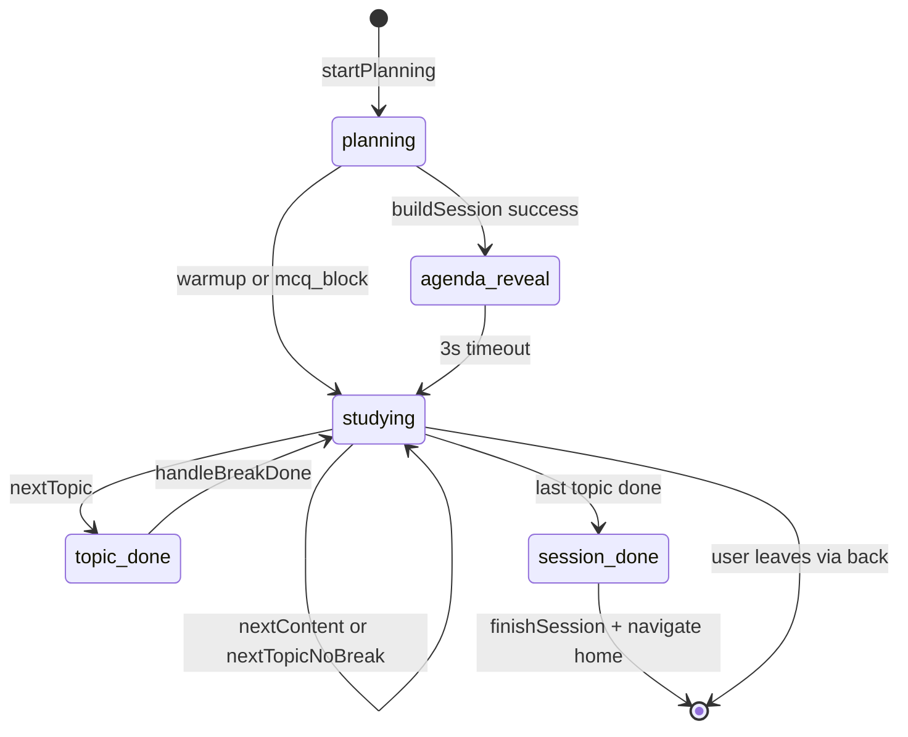

# Study Session - Current State Assessment and Improvement Plan

## Current Architecture

The study session is built from three core pieces:

- **SessionScreen.tsx** (1354 lines) - Single component handling ALL session UI states
- **useSessionStore.ts** (242 lines) - Zustand store with persisted session state
- **sessionPlanner.ts** (369 lines) - Topic scoring, AI-powered agenda building

### Session State Machine



---

## Issues Found

### P0 - Bugs and Crash Risks

1. **Double-fire on finishSession** - Both a `useEffect` on `sessionState === session_done` AND manual calls trigger `finishSession`. A `finishSessionLockRef` prevents double writes, but this is a band-aid for unclear state ownership.

2. **Stale state reads via getState** - `useSessionStore.getState()` is called 8+ times inside callbacks, bypassing React rendering. If the store updates between two consecutive `getState()` calls in the same callback, behavior is unpredictable.

3. **Timer leak on hot reload** - The master timer `setInterval` at line 361 is created inside a `useEffect` that depends on 5 values. If any dependency changes, a new timer starts but the old one is only cleaned up if the component unmounts.

4. **Agenda.items access without guards** - Multiple places access `agenda.items[currentItemIndex]` or `agenda?.items[currentItemIndex]` without checking if the index is in bounds. A corrupted persisted state with `currentItemIndex > items.length` would crash.

### P1 - Architecture

5. **God component** - SessionScreen.tsx is 1354 lines handling 6 different screen states (planning, agenda reveal, studying, break, topic done, session done), plus 2 inline sub-components (WarmUpMomentumScreen, SessionDoneScreen). This makes it hard to test, reason about, and modify without regressions.

6. **Implicit state machine** - Session state transitions are scattered across callbacks. There is no single place that defines which transitions are valid. For example, nothing prevents `planning -> session_done` directly.

7. **Content loading as a side effect** - The auto-load effect at line 410 has 10+ dependencies and uses both reactive state and imperative `getState()`. It re-fires on any dependency change, with guards to skip if content is already loaded.

8. **Session planner wide parameter list** - `buildSession` takes `mood, minutes, apiKey, orKey, groqKey, options` as positional args. The API keys are passed from the UI layer when they should be resolved internally.

### P2 - ADHD UX Gaps

9. **Timer state is local, not persisted** - `elapsedSeconds` and `activeElapsedSeconds` are `useState` in SessionScreen. If the app crashes or force-closes, active study time is lost even though the session itself persists via Zustand.

10. **No content retry with backoff** - If AI content fails, the user must manually tap Retry AI. For an ADHD user, this breaks flow. Auto-retry with backoff before showing the error would keep momentum.

11. **Silent break auto-end** - When break countdown hits 0, `tickBreak` silently ends the break. No haptic, no sound, no visual pop. The ADHD user may have wandered off and needs a stronger signal.

12. **Confidence mapping is hardcoded in UI** - `confidence >= 4 ? mastered : confidence >= 2 ? reviewed : seen` lives in the screen component rather than a domain function, making it impossible to unit test.

### P3 - Code Quality

13. **Inline sub-components** - `WarmUpMomentumScreen` and `SessionDoneScreen` are defined inside SessionScreen.tsx. They should be separate files.

14. **`downgradeSession` uses type cast** - `set({ agenda: newAgenda as Agenda })` bypasses type safety.

15. **`quiz` state is declared but unused** - `SessionState` includes `quiz` but it is never set anywhere in the codebase.

---

## Improvement Plan

### Phase 1: Defensive Hardening (low risk, high impact)

- [x] Add bounds checking on `agenda.items[currentItemIndex]` access everywhere
- [x] Move `elapsedSeconds` and `activeElapsedSeconds` into the Zustand store so they survive crashes
- [x] Extract confidence-to-status mapping into a pure function in `src/services/xpService.ts`
- [x] Remove the unused `quiz` session state
- [x] Add auto-retry with 2-attempt backoff to the content loading effect before showing error UI

### Phase 2: Component Decomposition (medium risk, high impact)

- [x] Extract `WarmUpMomentumScreen` to `src/screens/WarmUpMomentumScreen.tsx`
- [x] Extract `SessionDoneScreen` to `src/screens/SessionDoneScreen.tsx`
- [ ] Extract `SessionStudyingView` for the main studying render path (lines 739-931)
- [x] Extract `SessionHeader` component (topic name, pause, menu)
- [x] Extract `SessionMenu` overlay component

### Phase 3: State Machine Formalization (medium risk, high impact)

- [x] Create a `sessionStateMachine.ts` with explicit valid transitions:

```typescript
const VALID_TRANSITIONS: Record<SessionState, SessionState[]> = {
  planning: ['agenda_reveal', 'studying', 'session_done'],
  agenda_reveal: ['studying'],
  studying: ['studying', 'topic_done', 'session_done'],
  topic_done: ['studying', 'session_done'],
  session_done: ['planning'], // reset
};
```

- [x] Replace direct `setSessionState` calls with a `transitionTo` function that validates the transition
- [x] Consolidate `finishSession` to only be called from the state machine transition, removing the effect + manual call pattern

### Phase 4: Session Planner Cleanup (low risk, medium impact)

- [x] Refactor `buildSession` to accept a single config object instead of 6 positional args
- [x] Move API key resolution inside the planner (it already reads profile internally)
- [x] Fix the `downgradeSession` type cast by making the Agenda type accept optional `mode` override

### Phase 5: ADHD UX Polish (low risk, high UX impact)

- [x] Add haptic + notification when break auto-ends
- [ ] ~~Add content loading skeleton instead of LoadingOrb~~ (keeping LoadingOrb — it's characteristic)
- [x] Show a mini session summary in the Leave Session alert (topics done, minutes, XP)
- [x] Add progressive break reminders (vibrate at 30s, stronger at 10s, alarm at 0s)
